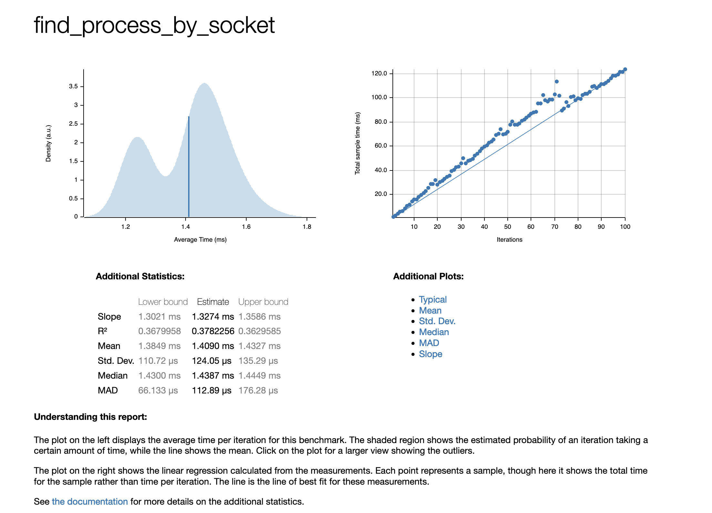

# proc-utils

## Introduction

find process name by given src addr and port

## How it work

### macOS

binding of [libproc](https://opensource.apple.com/source/xnu/xnu-2422.1.72/libsyscall/wrappers/libproc/libproc.h.auto.html)

# Bench

